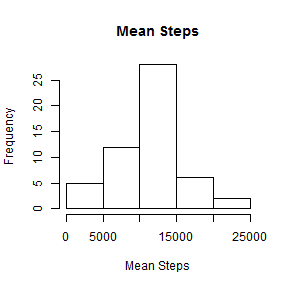
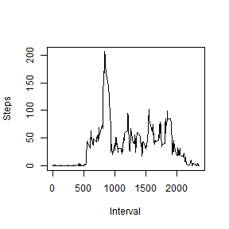
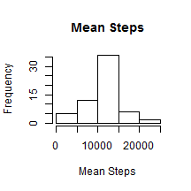

# Reproducible Research: Peer Assessment 1  


## Loading and preprocessing the data  

In the first step data are loaded. It is checked whether the file in question already exists, and if not is produced.
The file is read in directly from its net location, unzipped and and read in.
The object created is called "data"

```r
if (!file.exists("activity.csv")) {
    Url <- "https://d396qusza40orc.cloudfront.net/repdata%2Fdata%2Factivity.zip"
    setInternet2(use = TRUE)
    download.file(Url, destfile = "activity.zip")
    unzip("activity.zip")
    file.remove("activity.zip")    
 data<-read.csv("activity.csv")   
}
```

Before preprocessiong the data, the structure of the file is investigated.Then the data for the next two steps of the assignement are created. 


```r
str(data)
```

```
## 'data.frame':	17568 obs. of  3 variables:
##  $ steps   : int  NA NA NA NA NA NA NA NA NA NA ...
##  $ date    : Factor w/ 61 levels "2012-10-01","2012-10-02",..: 1 1 1 1 1 1 1 1 1 1 ...
##  $ interval: int  0 5 10 15 20 25 30 35 40 45 ...
```


```r
stepsDay <- aggregate(data$steps,list(data$date),sum)
names(stepsDay)<-c("day","meanSteps")

stepsInterval<-aggregate(data$steps,list(data$interval),mean,na.rm = TRUE)
names(stepsInterval)<-c("interval","aveSteps")
```

## What is mean total number of steps taken per day?  
A histogram of the total number of steps taken each day, missing values are ignored, is below:


```r
hist(stepsDay$meanSteps, 
     main="Mean Steps",
     xlab="Mean Steps")
```

 

Mean and median total number of steps taken per day, missing values ignored. 


```r
mean.steps.day<-mean(stepsDay$meanSteps,na.rm = TRUE)
median.steps.day<-median(stepsDay$meanSteps,na.rm = TRUE)
```

The mean total number of steps taken per day are 1.0766 &times; 10<sup>4</sup>.
The median total number of steps taken per day are 10765


## What is the average daily activity pattern?

Line graph of the daily activity. 

```r
plot(stepsInterval$interval,
     stepsInterval$aveSteps,
     type="l",
     xlab="Interval",
     ylab="Steps")
```

 

Finding the interval with the highest number of steps on avarage in a day.  


```r
maxInterval<-stepsInterval$interval[max(stepsInterval$aveSteps)]
```

The 5-minute interval, on average across all the days in the dataset, that contains the maximum number of steps is interval 1705

## Imputing missing values  

Note that there are a number of days/intervals where there are missing values (coded as NA). The presence of missing days may introduce bias into some calculations or summaries of the data.

###  Calculate the total number of missing values in the dataset 


```r
NAval<-sum(is.na(data$steps))
#NAval<-2304
```
The total number of rows with NAs is: 2304.

### Filling in the missing values in the dataset and creating new dataset that with the missing data filled in  

Filling strategy: Replace each NA with mean steps per interval and recalculate data


```r
#library(knitr)
ndata<-data #Create new dataset
Len<-length(unique(data$interval))#intervals in a day
ndata[is.na(ndata)] <- mean.steps.day/Len
#replace NA with mean steps in an interval

##Repeat calculation from above with new data set
nstepsDay<-aggregate(ndata$steps,list(ndata$date),sum)
names(nstepsDay)<-c("day","meanSteps")

nstepsInterval<-aggregate(ndata$steps,list(data$interval),mean)
names(stepsInterval)<-c("interval","aveSteps")

nmean.steps.day<-mean(nstepsDay$meanSteps)
nmedian.steps.day<-median(nstepsDay$meanSteps)

##calculate difference between new and old values
diffmean<-nmean.steps.day-mean.steps.day
diffmedian<-nmedian.steps.day-median.steps.day
```

### A new histogram    


```r
hist(nstepsDay$meanSteps, 
     main="Mean Steps",
     xlab="Mean Steps")
```

 

With NAs in the data set, the mean number of steps were 1.0766 &times; 10<sup>4</sup>, with NAs replaced with the mean number of steps, the mean has increased by 0 to 1.0766 &times; 10<sup>4</sup>. With NAs in the data set, the median number of steps were 10765, with NAs replaced with the mean number of steps, the mean has increased by 1.1887 to 1.0766 &times; 10<sup>4</sup>.


## Are there differences in activity patterns between weekdays and weekends?


```r
Dates<-as.Date(as.character(ndata$date),format="%Y-%m-%d")
WD<-weekdays(Dates, abbreviate=TRUE)

unique(WD)
```

```
## [1] "Mon" "Tue" "Wed" "Thu" "Fri" "Sat" "Sun"
```

```r
WD[WD=="Mon"]<-"Weekday"
WD[WD=="Tue"]<-"Weekday"
WD[WD=="Wed"]<-"Weekday"
WD[WD=="Thu"]<-"Weekday"  
WD[WD=="Fri"]<-"Weekday" 
WD[WD=="Sat"]<-"Weekend"  
WD[WD=="Sun"]<-"Weekend" 

ndata.wd<-cbind(ndata,WD)

##Steps averaged over intervals in weekdays
nstepsInterval.wd<-aggregate(ndata.wd$steps[ndata.wd$WD=="Weekday"],
                             list(ndata.wd$interval[ndata.wd$WD=="Weekday"]),mean)
nstepsInterval.wd<-cbind(nstepsInterval.wd,rep("Weekday",nrow(nstepsInterval.wd)))
names(nstepsInterval.wd)<-c("interval","aveSteps","WD")

##Steps averaged over intervals in weekends
nstepsInterval.we<-aggregate(ndata.wd$steps[ndata.wd$WD=="Weekend"],
                             list(ndata.wd$interval[ndata.wd$WD=="Weekend"]),mean)
nstepsInterval.we<-cbind(nstepsInterval.we,rep("Weekend",nrow(nstepsInterval.we)))
names(nstepsInterval.we)<-c("interval","aveSteps","WD")

##combining data for plot below
nstepsInterval.wde<-rbind(nstepsInterval.wd,nstepsInterval.we)
```


### Panel plot average steps per interval time series


```r
xyplot(aveSteps ~ interval | WD, data = nstepsInterval.wde, layout = c(1, 2), type="l", ylab="steps")
```

 

It appears that activity pattern vary between weekends and weekdays. Whereas  activity seems to be more equally distributed on weekends, main activity during the week seems to be in the morning hours.
